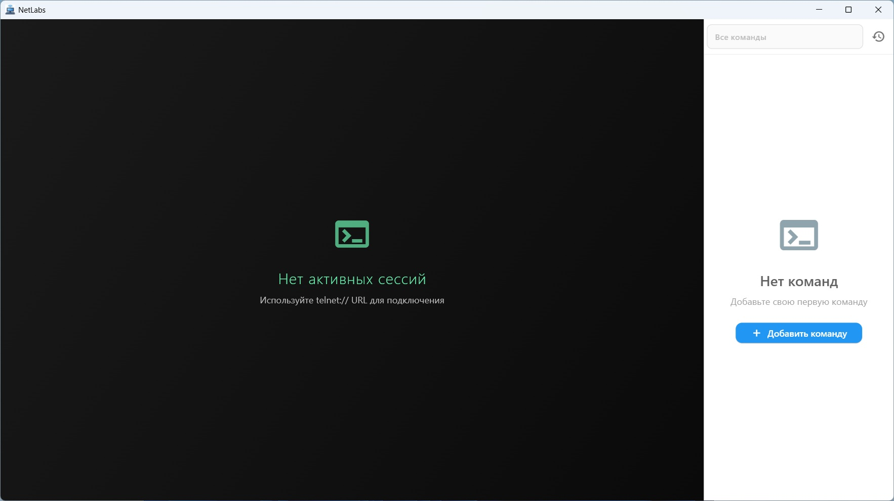
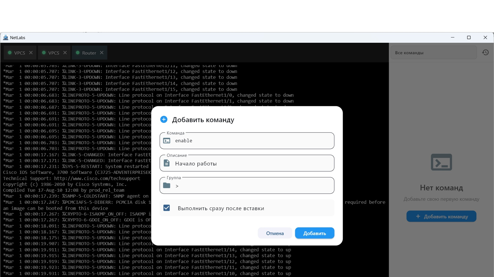
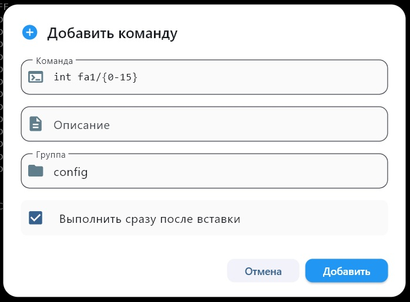
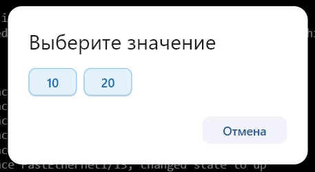
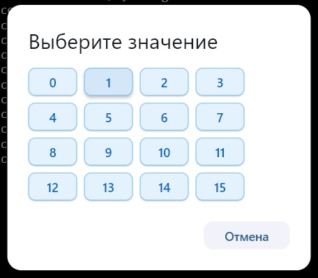

Это простой telnet терминал, написанный для выполнения лаб в EVE-NG.

Терминал позволяет подключаться к нескольким устройствам, 
создавать шаблоны команд для последующего выполнения их 
по клику в меню - не нужно вручную вводить текст команды.

Терминал сохраняет историю введённых команд на устройствах.

Настройки хранятся в %Documents%/FlutterTelnet:
* commands.hive - ваши сохранённые команды 
* history.hive - история команд 
* state.hive - данный открытых сессий

При открытии терминала в первый раз вы увидите такое окно

Кнопка "Все команды" позволяет переключать команды в 
зависимости от текущего контекста (текста перед #).

# Добавьте команды

Вы можете добавить шаблоны в команду, для этого укажите
значения в фигурных скобках {10 20}

Либо укажите интервал так {min-max}

# Запуск команд
Команды появятся в панели справа. 

При клике на команду, она введётся в терминал. 
Если стоит галочка "Выполнить сразу после вставки",
то после команды последует отправка Enter для исполнения команды.

Если в команде есть варианты или диапазон, то появится 
окно выбора варианта.

|||
|-|-|

# Лицензия
Лицензия MIT. Если найдёте ошибки - присылайте.